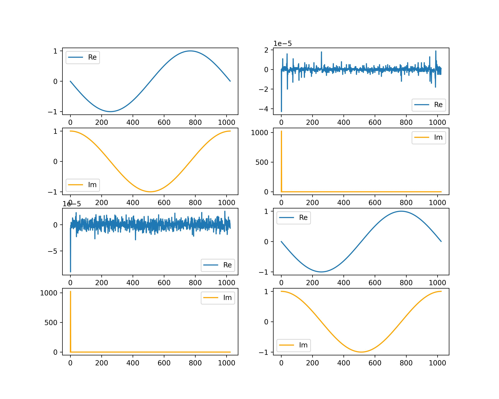

# FFT in place

This is an educational project implementing an in-place FFT algorithm for potential embedded applications. The entire library is contained in `fft.h` and `fft.c`.

# Fire up the demo

To see the demo in action:
```
make
./a.out
```

then

```
pip install -r requirements.txt
```
.
Then generate plots in `plot.ipynb`. You should be able to see plots like this for a couple different waveforms:


- top-left is the original waveform
- top-right is the fourier transform calculated in C
- bottom-left is the fourier transform calculated in numpy
- bottom-right is the waveform calculated via inverse fourier transform in numpy